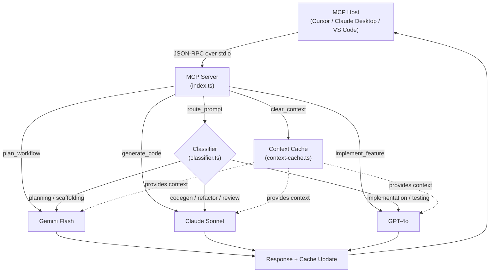
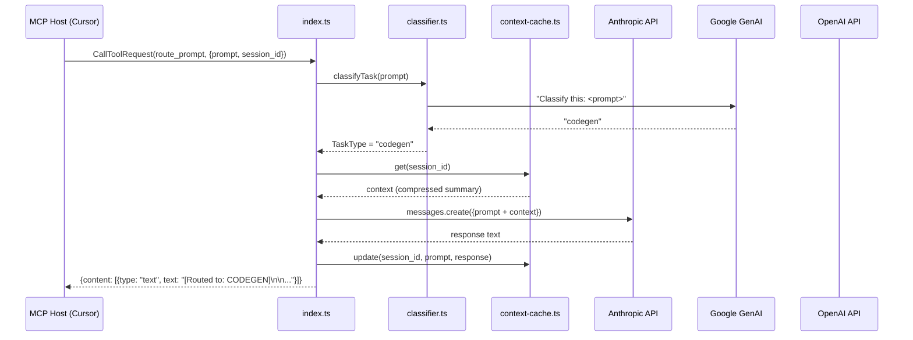

# LLM Router MCP — Complete Interview Deep-Dive

> **Your one-stop document to explain this project end-to-end in an interview.**

---

## 1. One-Liner Pitch

> "LLM Router MCP is a **Model Context Protocol server** that acts as an intelligent dispatcher — it analyses every incoming coding prompt, classifies its intent, and routes it to the **cheapest and most capable LLM** (Claude, Gemini, or GPT-4o) automatically."

---

## 2. The Problem It Solves

| Without the Router | With the Router |
|---|---|
| You hardcode **one** LLM for everything | Each prompt goes to the **best** model for that task |
| You overpay — Claude is expensive for simple scaffolding | Cheap tasks (planning, boilerplate) → Gemini Flash; hard tasks → Claude |
| No cross-model context | Session-aware context cache carries state across turns |
| Switching models requires code changes | MCP tools let any host (Cursor, Claude Desktop, VS Code) switch transparently |

**Key value proposition:** Cost optimisation + capability maximisation, completely automated.

---

## 3. What is MCP (Model Context Protocol)?

> [!IMPORTANT]
> This is the foundational concept. You **must** be able to explain MCP clearly.

MCP is an **open standard** (by Anthropic) that defines how AI-powered hosts (like Cursor, Claude Desktop, VS Code Continue) communicate with external **tool servers**. Think of it like USB-C for AI tools:

```
┌─────────────┐         JSON-RPC over stdio          ┌─────────────────┐
│  MCP Host    │  ◄──────────────────────────────►   │  MCP Server     │
│  (Cursor)    │    ListTools / CallTool requests    │  (llm-router)   │
└─────────────┘                                      └─────────────────┘
```

- The **host** discovers available tools via `ListToolsRequest`
- The **host** invokes tools via `CallToolRequest` with arguments
- The **server** responds with `content: [{ type: "text", text: "..." }]`
- Transport: **stdio** (stdin/stdout pipes) — no HTTP, no sockets

This project implements the **server** side of MCP.

---

## 4. High-Level Architecture



### Data Flow (for `route_prompt`):

1. **Host** sends `CallToolRequest` with `{ prompt, session_id }`
2. **index.ts** receives it → calls `classifyTask(prompt)` 
3. **classifier.ts** sends the prompt to **Gemini Flash** with a classification meta-prompt → returns one of 8 labels
4. **index.ts** looks up the label in `MODEL_MAP` → dispatches to the right model caller
5. The model caller prepends **context** from the cache (if any) and calls the real API
6. The response is **compressed** and stored in the context cache
7. Response is returned to the host

---

## 5. File-by-File Breakdown

### 5.1 `src/index.ts` — The Brain (239 lines)

This is the **MCP server entrypoint**. It does 5 things:

#### A. SDK Client Initialisation (lines 1–43)
```typescript
const anthropic = autoMock ? null : new Anthropic({ apiKey: ... });
const genai     = autoMock ? null : new GoogleGenerativeAI(...);
const openai    = autoMock ? null : new OpenAI({ apiKey: ... });
```
- Reads API keys from environment variables
- If any key is missing → `autoMock = true` → all clients are `null`
- **Graceful degradation**: never crashes, just uses mock mode

#### B. Three Model Callers (lines 47–91)

| Function | Model | API | Context Injection |
|---|---|---|---|
| `callClaude()` | `claude-sonnet-4-5` | Anthropic SDK | Prepends context to `user` message |
| `callGemini()` | `gemini-1.5-flash` | Google GenAI SDK | Concatenates context into a single prompt string |
| `callGPT4o()` | `gpt-4o` | OpenAI SDK | Injects context as a `system` message |

Each caller:
1. Checks `MOCK_MODE` first → returns mock if true
2. Logs which model it's routing to
3. Injects session context from the cache
4. Calls the respective API with `max_tokens: 4096`

> [!TIP]
> **Interview insight**: Each API handles context differently — Anthropic uses message roles, OpenAI separates system/user messages, Google uses a flat string. The code adapts to each SDK idiomatically.

#### C. The Router Map (lines 95–117)

```typescript
const MODEL_MAP: Record<TaskType, (p, c) => Promise<string>> = {
  planning:       callGemini,
  scaffolding:    callGemini,
  codegen:        callClaude,
  refactor:       callClaude,
  review:         callClaude,
  implementation: callGPT4o,
  testing:        callGPT4o,
  general:        callClaude,   // fallback
};
```

This is the **routing table** — a simple `Record` mapping task type → model caller function.

**Design rationale:**
- **Gemini** → planning/scaffolding: fast, cheap, good at structured output
- **Claude** → codegen/refactor/review: best code reasoning, nuanced understanding
- **GPT-4o** → implementation/testing: solid, cost-effective for formulaic tasks

#### D. Tool Registration (lines 126–195)

Registers **5 MCP tools** with the SDK:

| Tool | Behaviour | Use Case |
|---|---|---|
| `route_prompt` | Auto-classifies → auto-routes | Default, most common |
| `plan_workflow` | Always → Gemini | Explicit planning tasks |
| `generate_code` | Always → Claude | Explicit code generation |
| `implement_feature` | Always → GPT-4o | Explicit implementation |
| `clear_context` | Wipes session cache | Start fresh |

#### E. Tool Handler (lines 197–231)

A big `if/else` that dispatches based on `name`:
- Each explicit tool calls its model directly, then updates the cache
- `route_prompt` goes through the `route()` function (classifier → MODEL_MAP)
- All errors are caught and returned as `{ isError: true }`

#### F. Server Startup (lines 233–239)

```typescript
const transport = new StdioServerTransport();
await server.connect(transport);
```
Uses **stdio transport** — the MCP host communicates via stdin/stdout pipes.

---

### 5.2 `src/classifier.ts` — The Intent Classifier (54 lines)

**Purpose:** Given a user prompt, classify it into one of 8 task types.

**How it works:**
1. Sends the prompt to **Gemini 1.5 Flash** (cheapest, fastest model) with a **meta-prompt**:
   ```
   You are a task classifier for a coding assistant. 
   Given a user prompt, output EXACTLY one of these labels — nothing else:
   planning, scaffolding, codegen, refactor, review, implementation, testing, general
   ```
2. Parses the response, validates it against the allowed labels
3. Falls back to `"general"` if the label is unexpected or the API errors

**Key type exported:**
```typescript
export type TaskType = "planning" | "scaffolding" | "codegen" | "refactor" 
                     | "review" | "implementation" | "testing" | "general";
```

> [!NOTE]
> Using an LLM as a classifier (instead of regex/keyword matching) gives much better accuracy for ambiguous prompts. The regex-based approach is only used in mock mode.

---

### 5.3 `src/context-cache.ts` — Session Memory (90 lines)

**Purpose:** Maintain conversation context across multiple turns **within a session**, without blowing up token costs.

#### Data Structure
```typescript
interface SessionEntry {
  summary: string;      // compressed conversation history
  turnCount: number;    // how many turns in this session
  lastUpdated: number;  // timestamp for TTL eviction
}

// Storage: Map<sessionId, SessionEntry>
```

#### Key Methods

| Method | What it does |
|---|---|
| `get(sessionId)` | Returns the compressed summary (evicts stale sessions first) |
| `update(sessionId, prompt, response)` | Compresses and appends the new turn |
| `clear(sessionId?)` | Deletes one session or all sessions |

#### Compression Strategy (the clever part)

The `compress()` method **doesn't keep raw history**. Instead:

1. Takes the **last 200 chars** of the assistant response (the "conclusion")
2. Takes the **first 120 chars** of the user prompt (the "intent")
3. Formats as: `[Turn N] User: <snippet> | Assistant concluded: <tail>`
4. Appends to existing summary
5. If over **1200 chars** (~300 tokens), drops the **oldest turns** first

**Why this design:**
- Raw history grows linearly → token costs explode
- Summaries preserve the gist while staying under budget
- 1200 chars ≈ 300 tokens → adds ~$0.0003 per request at Claude pricing

#### TTL Eviction

Sessions expire after **30 minutes of inactivity** (`SESSION_TTL_MS = 30 * 60 * 1000`). The `evictStale()` method runs on every `get()` call, cleaning up abandoned sessions.

---

### 5.4 `src/mock.ts` — Zero-Cost Testing Mode (246 lines)

**Purpose:** Provides realistic mock responses so you can develop and test without spending money on API calls.

#### Mock Mode Activation
```typescript
export const MOCK_MODE = process.env.MOCK_MODE === "true" || !hasAllKeys;
```
Activates when:
- `MOCK_MODE=true` env var is set explicitly, OR
- Any API key is missing (auto-fallback)

#### Mock Classifier (`mockClassify`)

A **regex-based keyword matcher** (no API call):

```typescript
const KEYWORD_MAP: Array<[RegExp, TaskType]> = [
  [/test|spec|jest|vitest|unit test/i, "testing"],
  [/plan|architect|design|structure/i, "planning"],
  [/scaffold|boilerplate|setup/i, "scaffolding"],
  // ... etc
];
```
Iterates through patterns in priority order. Falls back to `"general"`.

#### Mock Model Callers

`mockCallClaude`, `mockCallGemini`, `mockCallGPT4o` all:
1. Add a **simulated delay** (200–300ms) to feel realistic
2. Classify the prompt using `mockClassify`
3. Return a pre-written response template from `MOCK_RESPONSES`

Each mock response:
- Clearly labels itself as `[MOCK — Model Name | task type]`
- Includes realistic-looking content (code snippets, bullet points, etc.)
- States "No API was called" at the bottom

> [!TIP]
> **Interview point**: Mock mode is a great demonstration of the **Strategy pattern** — the caller interface is identical (`(prompt, context) => Promise<string>`), but the implementation swaps between real API calls and mocks transparently.

---

### 5.5 `src/logger.ts` — Minimal Logger (3 lines)

```typescript
export function log(msg: string): void {
  process.stderr.write("[llm-router] " + new Date().toISOString() + " " + msg + "\n");
}
```

Writes to **stderr** intentionally — because **stdout is reserved for MCP JSON-RPC messages**. If the logger wrote to stdout, it would corrupt the MCP protocol stream.

---

### 5.6 `test-router.cjs` — End-to-End Test Suite (71 lines)

**How it works:**
1. Spawns the MCP server as a **child process** with `MOCK_MODE=true`
2. Sends JSON-RPC requests via the server's **stdin**
3. Reads JSON-RPC responses from the server's **stdout**
4. Asserts each response contains the expected keyword

**Test cases:**

| # | Test | Tool | Expected Keyword |
|---|---|---|---|
| 1 | Planning routes to Gemini | `route_prompt` | "PLANNING" |
| 2 | Codegen routes to Claude | `route_prompt` | "CODEGEN" |
| 3 | Testing routes to GPT-4o | `route_prompt` | "TESTING" |
| 4 | Review routes to Claude | `route_prompt` | "REVIEW" |
| 5 | Explicit plan_workflow | `plan_workflow` | "Gemini" |
| 6 | Explicit implement_feature | `implement_feature` | "GPT-4o" |
| 7 | Context cache continuity | `route_prompt` | "handler" |
| 8 | Clear context works | `clear_context` | "cleared" |

> [!IMPORTANT]
> The test spawns the actual compiled server and communicates via stdio — this is a true **integration test**, not a unit test with mocked imports.

---

### 5.7 `prompt-tester.cjs` — Interactive REPL (172 lines)

A CLI tool for manual testing. Spawns the server and provides:
- Type any prompt → auto-routed via `route_prompt`
- `/plan <prompt>` → force Gemini
- `/code <prompt>` → force Claude
- `/implement <prompt>` → force GPT-4o
- `/clear` → reset session
- `exit` → quit

Uses coloured terminal output with ANSI escape codes for a polished developer experience.

---

## 6. Design Patterns Used

| Pattern | Where | Why |
|---|---|---|
| **Strategy** | `MODEL_MAP` + mock swapping | Swap routing targets without changing caller code |
| **Factory** | `classifyTask()` decides which handler to invoke | Decouples classification from execution |
| **Adapter** | Each model caller adapts a different SDK to a common `(prompt, context) => string` interface | Hides API differences |
| **Middleware/Pipeline** | classify → route → cache update | Clean separation of concerns |
| **Graceful Degradation** | Auto mock when keys missing | Never crashes, always works |
| **TTL Cache** | `ContextCache` with 30min expiry | Prevents unbounded memory growth |

---

## 7. Technology Stack

| Layer | Technology | Version |
|---|---|---|
| Language | TypeScript | 5.x |
| Runtime | Node.js | ≥ 20 |
| Protocol | MCP SDK | 1.x |
| Anthropic API | `@anthropic-ai/sdk` | ^0.24.0 |
| Google API | `@google/generative-ai` | ^0.15.0 |
| OpenAI API | `openai` | ^4.52.0 |
| Build | `tsc` (TypeScript compiler) | — |
| Module System | CommonJS | `tsconfig: module: "CommonJS"` |
| Transport | stdio (stdin/stdout pipes) | — |

---

## 8. Cost Optimisation Breakdown

This is the project's **core value proposition**. Here's why each routing decision saves money:

| Task | Model | Why This Model | Approx. Cost (per 1K tokens) |
|---|---|---|---|
| Planning | Gemini 1.5 Flash | Fastest, cheapest; planning doesn't need code precision | ~$0.00004 |
| Scaffolding | Gemini 1.5 Flash | Boilerplate is simple, no need for expensive models | ~$0.00004 |
| Code Gen | Claude Sonnet | Best code reasoning; worth the premium for complex logic | ~$0.003 |
| Refactor | Claude Sonnet | Needs deep understanding of existing code | ~$0.003 |
| Review | Claude Sonnet | Best at nuanced critique and explanation | ~$0.003 |
| Implementation | GPT-4o | Solid, cheaper than Claude for formulaic tasks | ~$0.0025 |
| Testing | GPT-4o | Test generation is pattern-heavy, GPT-4o excels | ~$0.0025 |

**Classifier cost:** Uses Gemini Flash for classification (~$0.00004) — negligible overhead.

**Context cache savings:** By compressing history to ~300 tokens instead of passing raw history (could be 10K+ tokens), each subsequent turn saves ~$0.03 at Claude pricing.

---

## 9. How to Run It

```bash
# From source (mock mode — no API keys needed)
npm install
npm run build
npm start             # or: MOCK_MODE=true node dist/index.js

# With real APIs
export ANTHROPIC_API_KEY=sk-ant-...
export GOOGLE_API_KEY=AIza...
export OPENAI_API_KEY=sk-...
node dist/index.js

# Tests
npm test

# Interactive REPL
node prompt-tester.cjs
```

### Integration with Cursor / VS Code / Claude Desktop

Add to your MCP config:
```json
{
  "mcpServers": {
    "llm-router": {
      "command": "npx",
      "args": ["llm-router-mcp"]
    }
  }
}
```

The host discovers the tools automatically and can invoke them.

---

## 10. Potential Interview Questions & Answers

### Q1: "Why not just use one model for everything?"

> Different models have different strengths. Claude excels at nuanced code reasoning but is expensive. Gemini Flash is 75x cheaper for simple planning tasks. By routing intelligently, we get the **best output quality at the lowest cost**. It's like using a sports car for highways and a bicycle for a quick trip to the corner store — right tool for the right job.

### Q2: "How does the classifier work? What if it misclassifies?"

> In production mode, we use **Gemini Flash as a meta-classifier** — we send a carefully crafted system prompt that tells it to output EXACTLY one of 8 labels. It's cheap (~$0.00004 per classification) and fast. If the response is unexpected or the API errors, we fall back to `"general"` which routes to Claude (the safest default). The system is designed to **never crash on a bad classification**.

### Q3: "How does the context cache prevent token explosion?"

> Instead of keeping raw conversation history (which grows linearly and can hit 10K+ tokens), we **compress each turn** to ~320 chars: the first 120 chars of the user prompt + the last 200 chars of the response. We cap total context at 1200 chars (~300 tokens). If we exceed that, we drop the **oldest turns** first. This keeps the context cost under $0.001 per turn regardless of conversation length.

### Q4: "Why stdio instead of HTTP?"

> MCP standard uses **stdio transport** — the host spawns the server as a child process and communicates via stdin/stdout pipes. This is simpler than HTTP (no port conflicts, no CORS, no authentication needed), more secure (no network exposure), and is the standard adopted by Claude Desktop, Cursor, and VS Code Continue.

### Q5: "Why log to stderr?"

> Because **stdout is the MCP communication channel**. JSON-RPC messages flow through stdout. If we logged to stdout, it would corrupt the protocol stream and the host would fail to parse responses. stderr is the standard side-channel for diagnostic output.

### Q6: "What design patterns did you use?"

> **Strategy pattern** for model selection (MODEL_MAP swaps callers). **Adapter pattern** for each model caller (different SDKs, same interface). **Graceful degradation** via auto-mock when keys are missing. **TTL cache** for session management with automatic eviction.

### Q7: "How would you extend this to support streaming?"

> Each SDK supports streaming (Anthropic's `.stream()`, OpenAI's `stream: true`, Google's `generateContentStream()`). I'd modify the model callers to return `AsyncIterable<string>` instead of `Promise<string>`, and use MCP's streaming response capability to pipe chunks back to the host in real-time.

### Q8: "How would you add a new model (e.g., Llama 3)?"

> Three steps: (1) Add a new caller function `callLlama()` with the same `(prompt, context) => Promise<string>` signature. (2) Add a mock for it in `mock.ts`. (3) Update `MODEL_MAP` to route certain task types to it. The architecture is designed for easy extension — adding a model touches at most 3 files.

### Q9: "What are the limitations?"

> 1. **No streaming** — responses are returned all at once, which can feel slow for large outputs.
> 2. **Classifier accuracy** — keyword-based mock classifier is brittle; the LLM classifier is better but adds latency.
> 3. **No authentication/rate limiting** — relies on the host for access control.
> 4. **In-memory cache** — sessions are lost on server restart; could be improved with Redis or SQLite.
> 5. **Single-tenant** — one server instance per host; no multi-user support.

### Q10: "How does the testing strategy work?"

> The test suite (`test-router.cjs`) is an **integration test** — it spawns the actual compiled server as a child process with `MOCK_MODE=true`, sends real JSON-RPC messages via stdin, reads responses from stdout, and asserts each response contains the expected routing keyword. This validates the full pipeline: tool registration → classification → routing → context caching → response formatting.

---

## 11. Architecture Diagram — Complete Data Flow



---

## 12. Key Numbers to Remember

| Metric | Value |
|---|---|
| Total source files | 5 TypeScript files |
| Total lines of code (TypeScript) | ~400 lines |
| Supported models | 3 (Claude, Gemini, GPT-4o) |
| Task categories | 8 |
| MCP tools exposed | 5 |
| Context cache max | 1200 chars (~300 tokens) |
| Session TTL | 30 minutes |
| Mock delay | 200–300ms |
| Max tokens per response | 4096 |
| Node.js requirement | ≥ 20 |

---

> [!TIP]
> **Final interview tip:** Lead with the problem ("API costs are high, different models excel at different tasks"), then the solution ("intelligent routing + compression"), then the implementation details. Show you understand both the **why** and the **how**.
